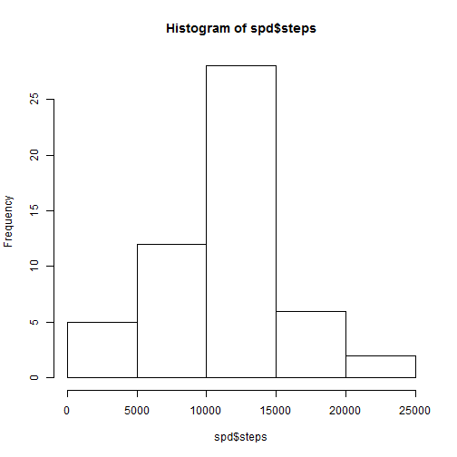

## Loading and preprocessing the data
Set the Working Directory and Load Raw data

```r
data <- read.csv("activity.csv")
```

## What is mean total number of steps taken per day?

Make a histogram of the total number of steps taken each day.


```r
spd <- aggregate(steps ~ date, data, sum)
hist(spd$steps)
```

 

Calculate and report the mean and median total number of steps taken per day.


```r
mean(spd$steps)
```

```
## [1] 10766.19
```

```r
median(spd$steps)
```

```
## [1] 10765
```


## What is the average daily activity pattern?

Make a time series plot (i.e. type = "l") of the 5-minute interval (x-axis) and the average number of steps taken, averaged across all days (y-axis).


```r
ada <- aggregate(steps ~ interval, data, mean)
plot(ada, type = "l")
```

 

Which 5-minute interval, on average across all the days in the dataset, contains the maximum number of steps?.

```r
ada$interval[which.max(ada$steps)]
```

```
## [1] 835
```

## Imputing missing values.


Calculate and report the total number of missing values in the dataset (i.e. the total number of rows with NAs)


```r
sum(is.na(data))
```

```
## [1] 2304
```


